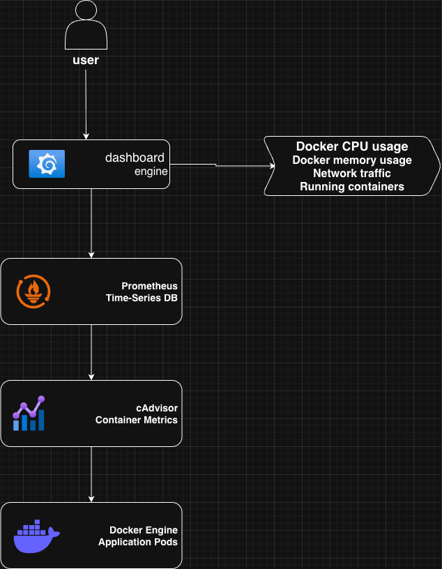

# Docker Monitoring Stack

A simple Docker monitoring setup using **Prometheus, Grafana, and cAdvisor** to collect and visualize container metrics.

## Architecture



## Tech Used
- Docker
- Docker Compose
- Prometheus
- Grafana
- cAdvisor
- Node.js

## Run the Project

Start the monitoring stack:

```
docker-compose up -d
```

## Services

Grafana → http://localhost:3000  
Prometheus → http://localhost:9090  
cAdvisor → http://localhost:8080  

## Grafana Dashboard


## Author
Sahil Mane
